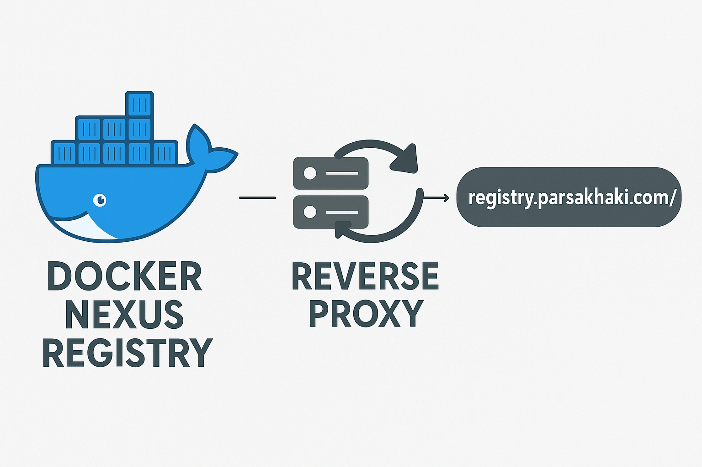

# Neutrino

## project setup

1- compelete cookiecutter workflow (recommendation: leave project_slug empty) and go inside the project
```
cd Neutrino
```

2- SetUp venv
```
virtualenv -p python3.10 venv
source venv/bin/activate
```

3- install Dependencies
```
pip install -r requirements_dev.txt
pip install -r requirements.txt
```

4- create your env
```
cp .env.example .env
```

5- Create tables
```
python manage.py migrate
```

6- spin off docker compose
```
docker compose -f docker-compose.dev.yml up -d
```

7- run the project
```
python manage.py runserver
```


# Security 
# 🛡️ XSS Protection System for Django Apps

## ✨ Overview

Before deploying any application to production, **user input must be sanitized** to prevent malicious attacks like **Cross Site Scripting (XSS)**.

This small but powerful module provides an extendable and maintainable structure for XSS protection by combining:

- ✅ Custom request validators
- ✅ Regex-based input filtering
- ✅ Django middleware integration
- ✅ **SOLID** principles for clean, scalable architecture

---

## 🚀 Features

- Detects potentially malicious XSS payloads using customizable regex
- Integrates easily with Django middleware and views
- Built with abstraction in mind for future extension
- Promotes **Dependency Inversion** and **Single Responsibility** principles
- Follows the **Open/Closed Principle** (easy to extend, no need to modify)

---

## 🧠 Architecture & Design Principles

This project is built on **SOLID Principles**:

| Principle | Applied How |
|----------|--------------|
| ✅ S - Single Responsibility | Each class has one responsibility: validation, request handling, configuration, etc. |
| ✅ O - Open/Closed | Easily extend or plug in new validators without modifying core logic |
| ✅ L - Liskov Substitution | Abstract classes/interfaces make it easy to substitute validators |
| ✅ I - Interface Segregation | Interfaces (`abstractmethod`) ensure each class only implements what it needs |
| ✅ D - Dependency Inversion | Validators are injected and separated from their usage contexts |

---

## 🧩 Code Structure

### 1. `BaseRequestValidator`

An abstract class for any validation provider that uses a `configure()` method on request:

```python
class BaseRequestValidator(ABC):
    def __init__(self, request):
        self._request = request
        self.configure()

    @abstractmethod
    def configure(self):
        ...
```


## XssSecurityProvider

### 1. `BaseRequestValidator`

A concrete implementation that scans all POST data and checks it against a regex pattern: 

```python
class XssSecurityProvider(BaseRequestValidator):
    def configure(self):
        regex_validator = RegexDjangovalidation()
        for key, value in self.request.POST.items():
            regex_validator.validate(value)

```
## Middleware Integration

### 1. `BaseRequestValidator`

Add full protection to your entire application by plugging in the middleware:
```python


class XssSanitizerMiddleware:
    def __init__(self, get_response):
        self.get_response = get_response

    def __call__(self, request):
        if request.method in ['POST', 'PUT']:
            try:
                XssSecurityProvider(request)
            except Exception as e:
                return JsonResponse(
                    {'error': 'Potential XSS attack detected', 'detail': str(e)},
                    status=403
                )
        return self.get_response(request)

```
➕ Add to your Django settings:
```python
# settings 
MIDDLEWARE = [
    ...,
    'yourapp.middleware.xss_middleware.XssSanitizerMiddleware',
]
```
   

# and why we just use midleware ???

- ### it is adaptabe to use in your api 
- Middleware is great for global protection, but sometimes you need fine-grained control.

- Middleware is great for global protection, but sometimes you need fine-grained control.
```python
from neutrino.core.provider import XssSecurityProvider

class CustomApiView:
    requests_provider = (XssSecurityProvider,)

```

# 🔐 Django `SECRET_KEY` Rotation with Celery

## 📌 Overview

This project includes a Celery task that automatically **rotates Django's **``, updates the `.env` file, and **restarts the service** using `supervisorctl`.

This mechanism improves application security and is useful in scenarios like periodic secret rotation or on-demand key changes.

---

## ✅ Current Implementation

- Uses Python's `secrets.token_urlsafe(64)` to generate a strong secret key.
- Safely replaces the old `SECRET_KEY` in the `.env` file by rewriting it (instead of using `sed`).
- Restarts the Django service (e.g., `neutrino`) via `supervisorctl`.
- Logs all actions and handles errors gracefully.

### Celery Task Code

```python
@shared_task(ignore_result=True) #TODO add The hasicorp value
def SECRET_KEY_CHANGE():
    new_secret_key = secrets.token_urlsafe(64)
    sed_command = f"sed -i 's/^SECRET_KEY=.*/SECRET_KEY={new_secret_key}/' .env && supervisorctl restart neutrino"
    subprocess.run(sed_command , shell=True , check=False)

```

---

## 🚧 Future Plans

> 🛠 **TODO: Integrate HashiCorp Vault**

- This current method is suitable for development and temporary setups.
- In production, we plan to **store **``** securely in HashiCorp Vault**, and dynamically fetch it at runtime or inject it through a secrets manager or environment injection system.
- This will eliminate the need to store sensitive keys in plaintext `.env` files and allow for secure secret rotation and audit logging.

---

```docker
$ docker run --cap-add=IPC_LOCK -e 'VAULT_DEV_ROOT_TOKEN_ID=neutrino' -e 'VAULT_DEV_LISTEN_ADDRESS=0.0.0.0:1234' hashicorp/vault
```
- get The my_secret_value

```bash 
vault kv put secret/neutrino/config SECRET_KEY="my_secret_value"
```
- how het it 
```bash
vault kv get secret/myapp/config
```

# How About Proudction 

## Compare About how we use docker registery 

**Required:**

- traefik
- docker


## Installation

```bash
# Basic version
docker compose up -d 


docker pull regitery.parsakhaki.com/services/backend/neutrino:lastest

```
# for more info about docker and docker registry 
- ## https://github.com/overdoseparsa/Django-Ci-CD.git
<br><br>



